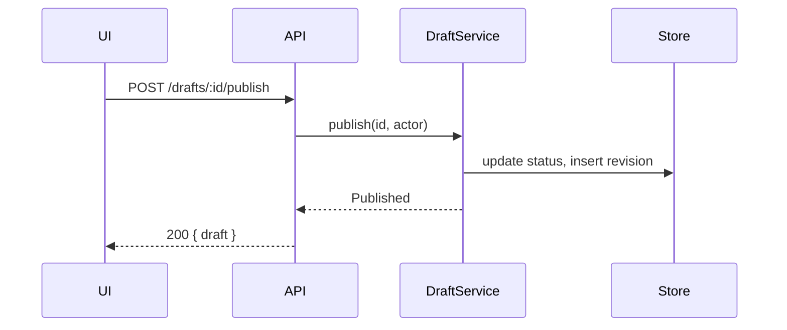

# System architecture

Phase 2 of 4. Produces `02-architecture.md`.

Read `${CLAUDE_PLUGIN_ROOT}/references/artifact-conventions.md` and
`${CLAUDE_PLUGIN_ROOT}/references/critical-inquiry.md` before drafting.

Requires an approved `01-product.md`. If it does not exist or is still
`status: draft`, stop and say so.

This phase settles the seams: what talks to what, in what shape, and what
happens when it fails. It stops short of the shape of the code, which is phase
3.

## Step 1: Ground in the codebase

Architecture written without reading the existing system is fiction. Before
drafting, dispatch `codebase-researcher` subagents — in parallel — for the
questions you actually need answered. Typical dispatches:

- How is this domain currently modelled and where does the data live?
- What is the existing pattern for this kind of endpoint or handler?
- Where are the boundaries — auth, validation, transaction, error mapping?
- What already exists that this could reuse or must not duplicate?

Every claim about existing code in the artifact carries a `path/to/file.ts:42`
citation. An uncited assertion about the codebase is a guess wearing a
confident tone, and it is rejected at the gate. If research came back
inconclusive, write "unknown" — that is a useful finding, not a failure.

Skip research only for genuinely greenfield work with no repository to read.

## Step 2: Draft `02-architecture.md`

```markdown
---
feature: <slug>
phase: architecture
status: draft
depth: full
updated: YYYY-MM-DD
---

# <Feature name> — architecture

## Current state
What exists today, with file:line citations. Short. Enough that a cold reader
knows what is being changed.

## Flow
A Mermaid sequence diagram of the main path. One diagram, not five.

## Contract
The interface between the parts. See references/contract-design.md.

## Data model
The schema diff — new tables, changed columns, new indexes, and the query
shapes that justify them.

## Failure modes
A table: what can fail, what the user sees, what the system does, whether it is
safe to retry.

## Migration and rollback
How this ships without breaking users mid-flight, and how it is undone.

## Boundaries
What is now coupled that was not before. Name the one-way doors explicitly.

## Deferred to program design
Notes that belong in phase 3.
```

### Flow diagram

Keep it to the participants that matter. A diagram with eleven participants has
stopped being a communication tool.



### Failure modes table

```markdown
| Failure                  | User sees            | System does           | Retry-safe |
|--------------------------|----------------------|-----------------------|------------|
| Store write times out    | "Couldn't publish"   | No status change      | Yes        |
| Revision insert fails    | "Couldn't publish"   | Rolls back status     | Yes        |
| Actor lost permission    | "No longer allowed"  | 403, no change        | No         |
```

Filling this in honestly is where most architecture bugs get caught. If a row's
retry column is "no" and the client will retry anyway, that is a design problem
to surface now.

## Step 3: Gate

Stop. Present contestable decisions, assumptions, open questions, and the file
path. Open questions here are usually forks — retry semantics, ownership of a
check, whether a column is nullable — so put them up as elicited options with
the consequence of each spelled out, per `critical-inquiry.md` § How to ask. Do
not continue to program design.

For `depth: medium`, this content is merged into `01-product.md` rather than
getting its own file, and phase 3 is skipped — go to `plan-slices` after
approval.
