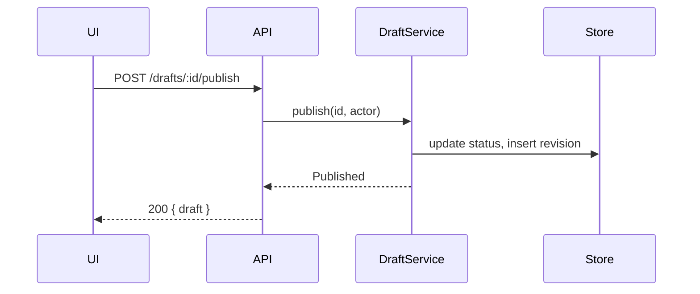

# System architecture

Phase 2 of 4. Produces `02-architecture.md`.

Read `${CLAUDE_PLUGIN_ROOT}/references/artifact-conventions.md`,
`${CLAUDE_PLUGIN_ROOT}/references/critical-inquiry.md`, and
`${CLAUDE_PLUGIN_ROOT}/references/sketch-checkpoints.md` before drafting.

Requires an approved `01-product.md`. If it does not exist or is still
`status: draft`, stop and say so.

Approved does not mean frozen. Where the seams show that a product decision is
unbuildable, or costs far more than it looked like it would, say so at the
checkpoint that raised it rather than designing quietly around it — see
`${CLAUDE_PLUGIN_ROOT}/references/artifact-conventions.md` § Amending an
upstream artifact for the branches and how an amendment is written.

This phase settles the seams: what talks to what, in what shape, and what
happens when it fails. It stops short of the shape of the code, which is phase
3.

## Step 1: Ground in the codebase

Architecture written without reading the existing system is fiction. Before
drafting, dispatch `codebase-researcher` subagents — in parallel — for the
questions you actually need answered. Typical dispatches:

- How is this domain currently modelled and where does the data live?
- What is the existing pattern for this kind of endpoint or handler?
- Where are the boundaries — auth, validation, transaction, error mapping?
- What already exists that this could reuse or must not duplicate?

Every claim about existing code in the artifact carries a `path/to/file.ts:42`
citation. An uncited assertion about the codebase is a guess wearing a
confident tone, and it is rejected at the gate. If research came back
inconclusive, write "unknown" — that is a useful finding, not a failure.

What comes back is input to your thinking, not content for the document. Do not
pass research through into the artifact: no pasted code, no walking a file from
top to bottom in prose, no summary of a module the reader can open. Current
state is the few facts this design turns on, one line and one citation each. The
rest of what you learned earns its place only if it changes a decision here.

Skip research only for genuinely greenfield work with no repository to read.

## Step 2: Sketch the seams in the conversation

Four checkpoints, in this order, before the file exists — each drawn in chat at
full fidelity with one elicitation on it, per
`${CLAUDE_PLUGIN_ROOT}/references/sketch-checkpoints.md`.

**1. The flow.** The Mermaid sequence diagram, with the participants you
actually mean. Its contestable part is the participant list: every box on it is
a component that now knows about this feature, and that is the coupling
decision, made before anyone calls it one.

**2. The contract.** Format in `references/contract-design.md`. The fork here
is nearly always a real one — where a check lives, what an error looks like on
the wire, whether a field is optional — so draw the two candidate shapes and
let the human choose between them rather than critique one.

**3. The data model.** The schema diff and the query shapes that justify it.
Ask about the column that is about to be nullable, and about what happens to
rows that already exist.

**4. The failure modes.** The table, filled in honestly. This is where the
phase earns its keep, so it gets its own stop rather than arriving as the tail
of a finished document. A row whose retry column says no, against a client that
will retry anyway, is the finding — surface it here.

Current state, migration and rollback, and boundaries do not get checkpoints.
The first is research you already did and cite; the others are consequences of
the four drawings above, and are presented at the gate.

## Step 3: Draft `02-architecture.md`

Write the settled drawings in, as drawn, and record any rejected alternative in
one line — "chose X over Y because Z", not the argument that got you there.

Keep it to about two screens outside the drawings, per `artifact-conventions.md`
§ Length and duplication. This document inherits a problem statement, a set of
users, and acceptance criteria from `01-product.md` — cite that file, never
restate it. What is written here is what phase 2 decided and nothing else.

Drop the sections this feature does not have. No persistence means no Data model
and nothing to migrate or roll back; a change behind an existing interface may
have no Boundaries worth naming. Do not render a heading over the word "N/A".
Failure modes is the exception — if you believe there are none, write the
sentence saying why, because that claim is usually wrong and stating it is how
it gets caught.

```markdown
---
feature: <slug>
phase: architecture
status: draft
depth: full
updated: YYYY-MM-DD
---

# <Feature name> — architecture

## Current state
Only the facts this design turns on — one line and one `file:line` citation
each, ten lines at most. Not a tour of the module, and never transcribed code.

## Flow
A Mermaid sequence diagram of the main path. One diagram, not five.

## Contract
The interface between the parts. See references/contract-design.md.

## Data model
The schema diff — new tables, changed columns, new indexes, and the query
shapes that justify them.

## Failure modes
A table: what can fail, what the user sees, what the system does, whether it is
safe to retry.

## Migration and rollback
How this ships without breaking users mid-flight, and how it is undone.

## Boundaries
What is now coupled that was not before. Name the one-way doors explicitly.

## Deferred to program design
Notes that belong in phase 3.
```

### Flow diagram

Keep it to the participants that matter. A diagram with eleven participants has
stopped being a communication tool.



### Failure modes table

```markdown
| Failure                  | User sees            | System does           | Retry-safe |
|--------------------------|----------------------|-----------------------|------------|
| Store write times out    | "Couldn't publish"   | No status change      | Yes        |
| Revision insert fails    | "Couldn't publish"   | Rolls back status     | Yes        |
| Actor lost permission    | "No longer allowed"  | 403, no change        | No         |
```

Filling this in honestly is where most architecture bugs get caught. If a row's
retry column is "no" and the client will retry anyway, that is a design problem
to surface now.

## Step 4: Gate

Stop. Present contestable decisions, assumptions, open questions, and the file
path. Open questions here are usually forks — retry semantics, ownership of a
check, whether a column is nullable — so put them up as elicited options with
the consequence of each spelled out, per `critical-inquiry.md` § How to ask. Do
not continue to program design.

Most of those forks should have been settled at the checkpoints, where the
diagram or the table that raises them was on screen. What reaches this gate is
what the drawings did not surface.

On approval, set `status: approved`, then commit and push —
`plan(<feature-slug>): architecture`, per `artifact-conventions.md` § What gets
committed. Where this phase amended `01-product.md`, that edit rides in the same
commit. Then stop; `plan-program` waits to be asked.

For `depth: medium`, this content is merged into `01-product.md` rather than
getting its own file, and phase 3 is skipped — so the commit amends the product
artifact rather than adding one (`plan(<feature-slug>): architecture` still, on
the merged file), and the next step after approval is `plan-slices`.
